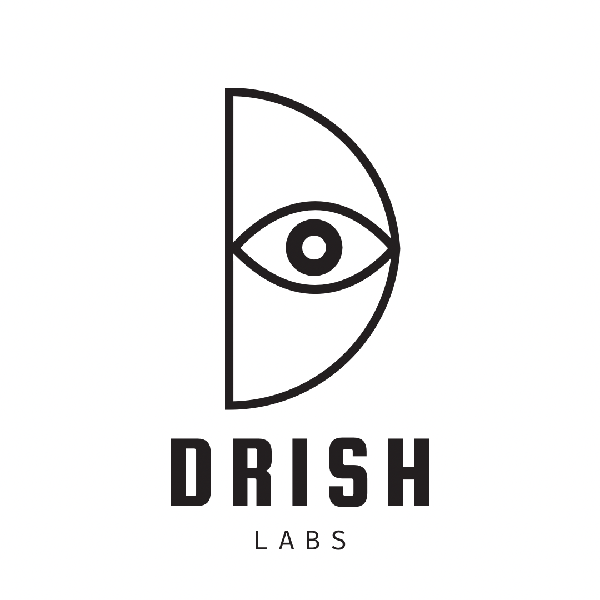
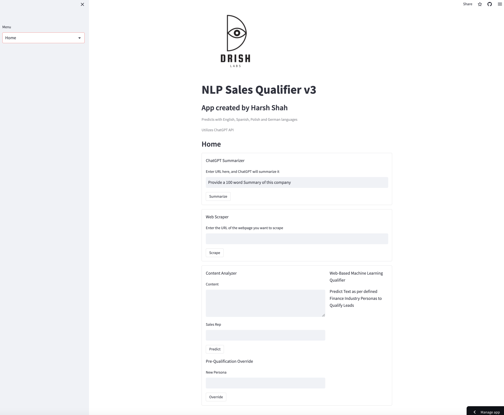
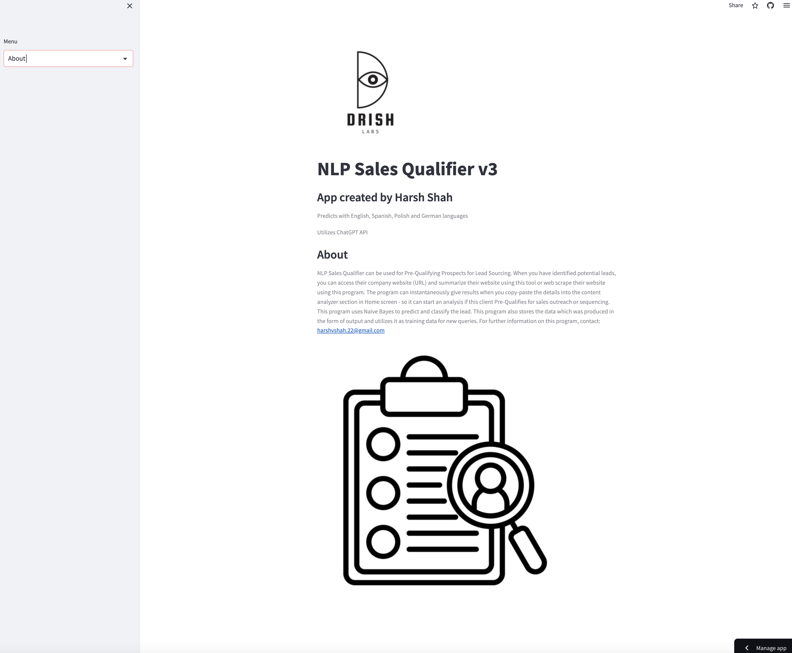
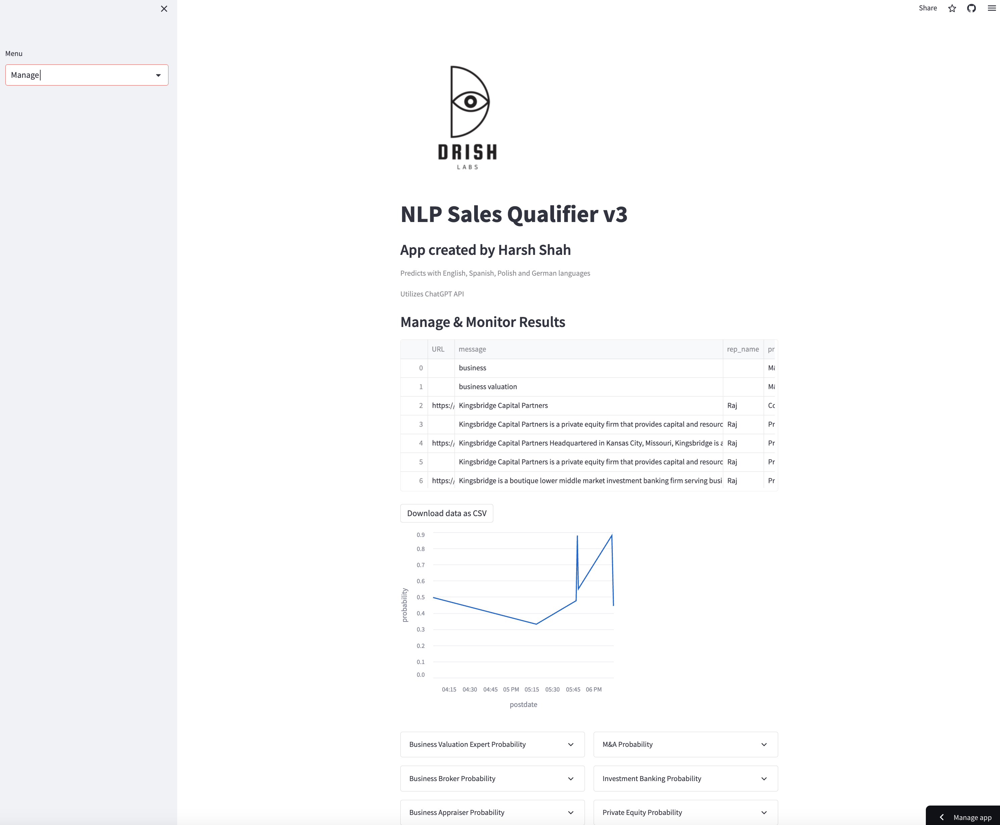

  #  NLP Sales Qualifier

## App Overview

### Description

NLP Sales Qualifier can be used for Pre-Qualifying Prospects for Lead Sourcing. When you have identified potential leads, you can access their company website (URL) and summarize their website using this tool or web scrape their website using this program. 
The program can instantaneously give results when you copy-paste the details into the content analyzer section in Home screen - so it can start an analysis if this client Pre-Qualifies for sales outreach or sequencing. 
This program uses Naive Bayes to predict and classify the lead. This program also stores the data which was produced in the form of output and utilizes it as training data for new queries.

## App Screenshots

## Demo
Watch this video to get complete demo of the functionality (https://vimeo.com/897893213)

# Getting Started

This is a Python based app which is stacked on Streamlit.

## Dependencies
* altair, beautifulsoup4, matplotlib, numpy, openai, pandas.
* Pillow, requests, river, seaborn, streamlit.

## Step 1: Start the Streamlit Server

After install all dependencies with pip.

First, you will need to start Streamlit with - streamlit run nlp.py

## Step 2: Run Test Case

Start testing lead qualification per the demo video.

## Help

Any advise or help regarding issues, you can contact: harshvshah.22@gmail.com

## Authors

Contributors names and contact info:
* Harsh Shah [@_AIARXR](https://twitter.com/_AIARXR)

## License

This project is licensed under the MIT License.

## Version History! :tada:

* v3
    * Initial Release

# Learn More

  To learn more about Python, take a look at the following resources:

* A Byte of Python, by Swaroop C.H. An introductory text for beginners and experienced programmers looking to learn Python.

* https://www.edx.org/course/cs50s-introduction-to-programming-with-python - This is a really excellent online course by David Malan at Harvard

## Acknowledgments

* Utilised this in the company I work at and it was a great success.
